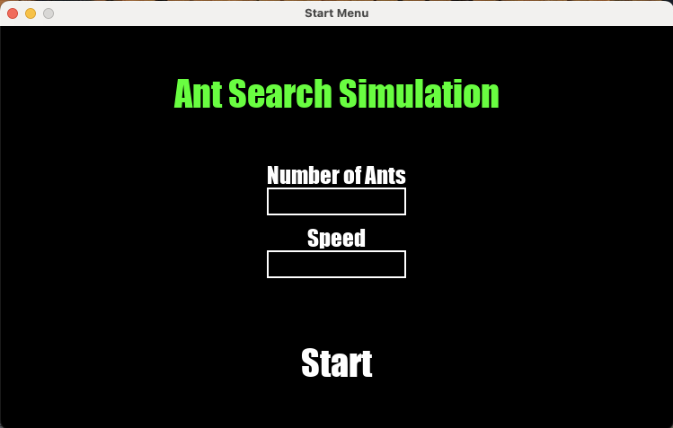
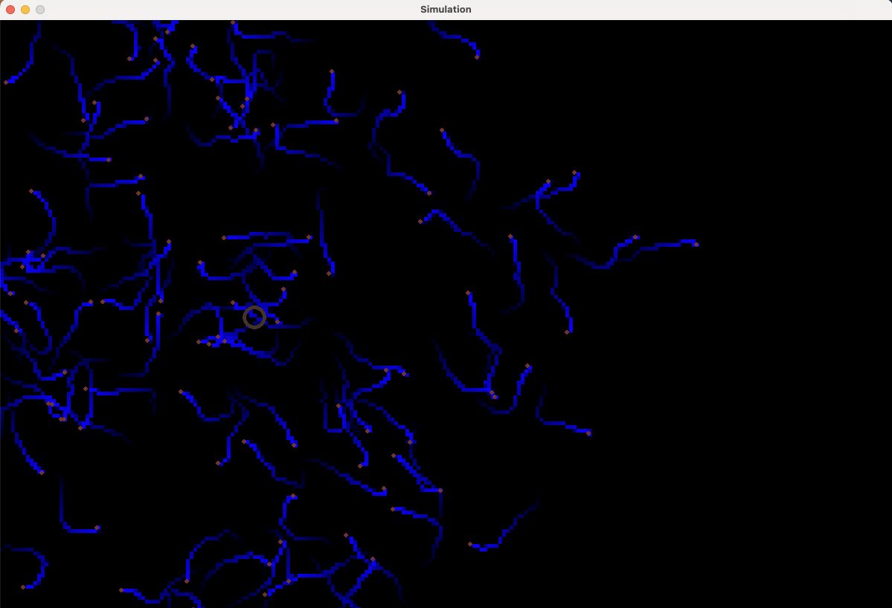

## Dependencies

 - Python
 - Pygame
 - Numpy

## Installation
First Clone the Github repository:
```
git clone https://github.com/lucasthierry17/Ant_Project.git
```
Go into the repo:
```
cd Ant_Project
```
then install all Dependencies:
```
pip install -r requirements.txt
```

## How to run the simulation
1. navigate to the 'source' folder:
   ```console
   cd source
   ```
2. run the main.py file
   ```console
   python main.py
   ```
### First you see the start menu

- here you can select the parameters you want
- type in a value for the number of ants
- then type in a speed value
- press the START button to start the simulation

### Then the simulation screen opens


### Food Placement
You can place and remove food sources by simple mouse clicks

https://github.com/lucasthierry17/Ant_Project/assets/96741488/c9d30cf5-9261-4a96-8739-0196ba421fdf
- press left mouse button to place a new food source where you want
- press right mouse button on the food source you want to remove

### Restart with new parameters
To restart the simulation with new parameters simpy press 'ENTER'

- Then the simulation stops and the start menu reopens
- there you can put in new variables and restart the simulation

## Developer Documentation

Include a link to your project's full documentation here.

## Authors

- [Lucas Müller](https://github.com/LucasThierry17)
- [Fouad Mokhtari](https://github.com/Fouad1806)
- [Sven Ochmann](https://github.com/svenatgithub)
- [Nick Grabowski](https://github.com/nickno7)


